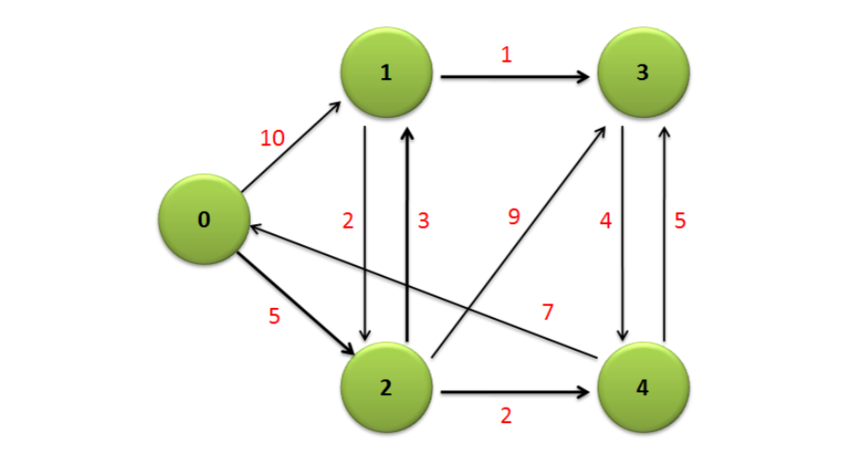
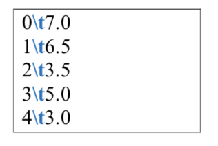
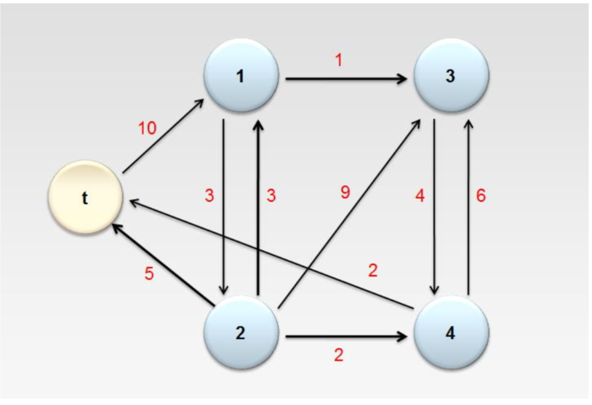
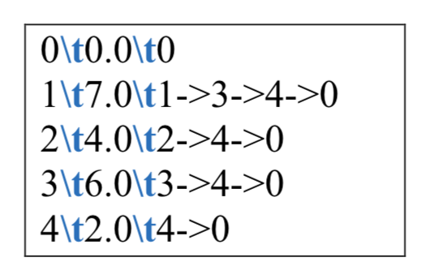

# MapReduce

Demonstrate understanding in Hadoop MapReduce.

input for both MapReduce will be : tiny-graph.txt

There is more advanced input provided.

# 1st: Average Length of outgoing nodes (EdgeAverage.jar)

Get the average length of outgoing nodes

From diagram above, we will have to map all the outgoing edge, and then from those map, reduce to get the average.

I create this solution in two possible ways, one which utilize the Combiner, and another which only use Map-Reduce.

# 2nd: Single Target Shortest Path (STSP)

Choose a single node, and get the shortest path from all connected nodes to that particular chosen nodes.

This technique utilize iteration, and truthfully speaking, Map-Reduce is not optimized to solve this problem.

